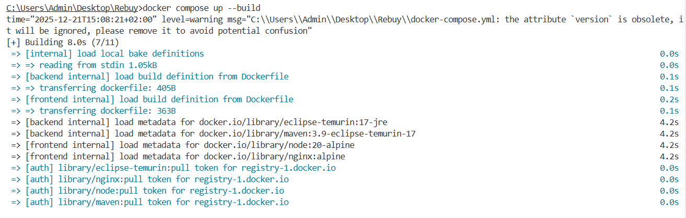
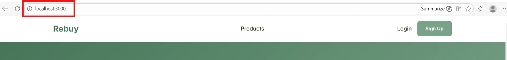
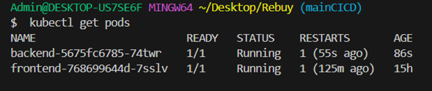
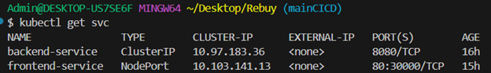
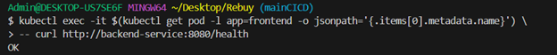
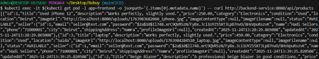
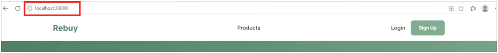
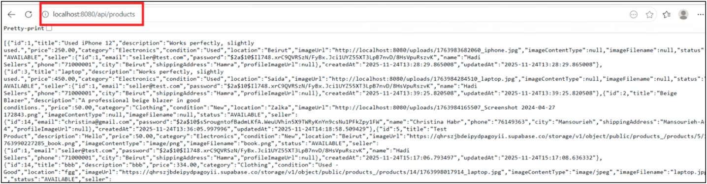

Rebuy – DevOps, CI/CD & Containerization Project
Project Overview:
The Rebuy Website is an e-commerce platform designed to help users easily repurchase or rebuy previously used items. It allows customers to browse, buy, and resell products they have already owned, promoting sustainable consumption and reducing waste. By giving products a second life, the website encourages eco-friendly shopping habits while helping users save money.
Rebuy is a full-stack web application developed as part of the DevOps, CI/CD & Containerization course.

The objective of this project is to demonstrate the complete DevOps lifecycle of a modern application, including:

•	Containerization using Docker

•	Automated CI/CD pipelines

•	Deployment on Kubernetes

•	Secure configuration and persistence management

Architecture Overview:
The application follows a client–server architecture composed of the following components:

•	Frontend: Angular application served using Nginx

•	Backend: Spring Boot REST API (Java 17)

•	Database: External PostgreSQL database hosted on Supabase (Option B)

•	Containerization: Docker & Docker Compose

•	CI/CD: GitHub Actions

•	Container Registry: GitHub Container Registry (GHCR)

•	Orchestration: Kubernetes (Docker Desktop)

•	Security: Kubernetes Secrets, Trivy vulnerability scanning

This architecture ensures modularity, scalability, and adherence to DevOps best practices.

Application Features:

•	Product listing and management

•	User management

•	Image upload and storage using Supabase Storage

•	Persistent data storage using PostgreSQL

•	RESTful API communication between frontend and backend

Docker & Containerization:
Dockerfiles
The project uses multi-stage Dockerfiles to optimize image size and performance:

•	Backend:
   
    o	Build stage using Maven
    
    o	Runtime stage using a lightweight JRE

•	Frontend:
    
    o	Build stage using Node.js
    
    o	Runtime stage using Nginx

This approach ensures efficient and production-ready Docker images.

In addition to the Dockerfiles, the project includes .dockerignore files for both the frontend and backend services. These files are used to exclude unnecessary and sensitive files from the Docker build context, improving build performance, reducing image size, and preventing accidental inclusion of development artifacts.

Docker Compose:
Docker Compose is used for local development and testing of the Rebuy application.

•	The Compose stack defines the following services:
   
    o	Frontend service: Angular application served via Nginx and exposed on port 3000.
    
    o	Backend service: Spring Boot REST API exposed on port 8080.

•	The database is hosted externally on Supabase (PostgreSQL); no local database container is required.

•	Environment variables are injected securely using a .env file, which is not committed to the repository.

•	A health check is configured for the backend using the /actuator/health endpoint.

•	The frontend service starts only after the backend becomes healthy using depends_on.

•	A named Docker volume is used to persist backend logs across container restarts.

•	A dedicated bridge network enables isolated inter-service communication.

Docker Desktop must be running before testing the Docker Compose setup.
The application stack is built and started using:
docker compose up --build

 

The frontend application can be accessed at: http://localhost:3000

 
CI/CD Pipeline: 
A complete CI/CD pipeline is implemented using GitHub Actions to automate testing, building, security scanning, and image publishing. The pipeline is triggered on pushes and pull requests to the main and mainCICD branches, on version tags, and can also be executed manually for demonstration purposes.
Pipeline Stages

1.	Unit Tests

  	o	Sets up Java 17 and executes Spring Boot unit tests using Maven.

  	o	Ensures code correctness before moving to later stages.

  	o	Test reports are uploaded as artifacts for traceability.

2.	Docker Image Build

  	o	Builds the backend Docker image using a multi-stage Dockerfile.

  	o	Uses Docker Buildx and QEMU to generate multi-architecture images (amd64, arm64).

  	o	Build metadata is generated using commit SHA or Git tags.

  	o	The built image is stored temporarily as an artifact.

3.	Security Scan (Bonus)

  	o	Uses Trivy to scan the backend source and dependencies for vulnerabilities.

  	o	Focuses on HIGH and CRITICAL severity issues.

  	o	Security results are uploaded in SARIF format for analysis.

4.	Image Push

  	o	Authenticates securely to GitHub Container Registry (GHCR).

  	o	Pushes versioned and latest Docker images only after all previous stages succeed.

  	o	Ensures reproducible and trusted images for Kubernetes deployment.

5.	Deployment Verification

   	o	Generates a deployment report summarizing pipeline execution.

   	o	Provides the exact Docker image reference to be used in Kubernetes manifests.

This CI/CD pipeline enforces code quality, security checks, and reproducible container builds, while database persistence is validated through Docker Compose and Kubernetes deployment.

Kubernetes Deployment:
Backend Kubernetes Deployment:
The backend is deployed using a Kubernetes Deployment with one replica, suitable for local development and demonstration.
The Spring Boot backend container runs on port 8080 using the rebuy-backend:latest image.
The backend exposes a REST API, including the /api/products endpoint, which handles product listing and management operations.

A readiness probe is configured on the /api/products endpoint:

•	Ensures the backend is fully initialized and able to serve product-related requests before receiving traffic.

•	Prevents Kubernetes from routing traffic to the pod until the API is ready.

A liveness probe is configured on the custom /health endpoint:

•	Verifies that the backend application remains responsive during runtime.

•	Automatically restarts the container if the health check fails.

This configuration ensures reliable startup and continuous health monitoring within the Kubernetes cluster.

Frontend Kubernetes Deployment:
The frontend is deployed using a Kubernetes Deployment with one replica, sufficient for local testing and demonstration.
The frontend container runs the Angular application served by Nginx and listens on port 80.
The container uses the rebuy-frontend:latest image and follows a lightweight runtime configuration.
A Kubernetes Service of type NodePort is used to expose the frontend outside the cluster.
The frontend service maps container port 80 to NodePort 30000, allowing access from the host machine.
The application can be accessed locally at: http://localhost:30000.
The frontend communicates with the backend through the internal Kubernetes service, enabling reliable service discovery.

Configuration and Secrets Management:
Application configuration is managed externally using Kubernetes resources.
A ConfigMap is used to store non-sensitive configuration such as the active Spring profile and the database connection URL.
A Secret  is used to securely store sensitive credentials, including database authentication details and Supabase keys.
These resources are injected into the backend deployment as environment variables, ensuring secure configuration management without exposing sensitive information in the repository.

Kubernetes Deployment Verification
After applying the Kubernetes manifests located in the k8s/ directory, which contains the deployment, service, ConfigMap, and Secret files for both frontend and backend, the application was deployed using the following commands:

kubectl apply -f k8s/configmap.yaml
kubectl apply -f k8s/secret.yaml
kubectl apply -f k8s/backend/deployment.yaml
kubectl apply -f k8s/backend/service.yaml
kubectl apply -f k8s/frontend/deployment.yaml
kubectl apply -f k8s/frontend/service.yaml

The deployment was verified using the following commands.

•	Verify that all pods are running:

•	Verify that all services are correctly created:

 
•	Test internal communication between the frontend and backend using the backend health endpoint:
 

•	Test the backend product API from within the cluster:
 
 

•	Verify external access to the application through the frontend NodePort service:
 

•	Verify direct access to the backend API (for development and debugging purposes):
 

These checks confirm correct pod execution, service discovery, internal communication between frontend and backend, and successful external access to the application.

Database Configuration – Option B (External Database)
The application uses an external Supabase PostgreSQL database.
Justification for Option B:

•	Simplifies Kubernetes state management

•	Ensures secure and managed persistence

•	Avoids the complexity of StatefulSets for a student project

•	Allows focus on CI/CD and orchestration concepts

The database connection is secured using SSL.

Conclusion
This project demonstrates a complete DevOps workflow, from containerization and automated CI/CD pipelines to Kubernetes deployment.
It follows industry best practices and fulfills all the requirements of the DevOps, CI/CD & Containerization course.

